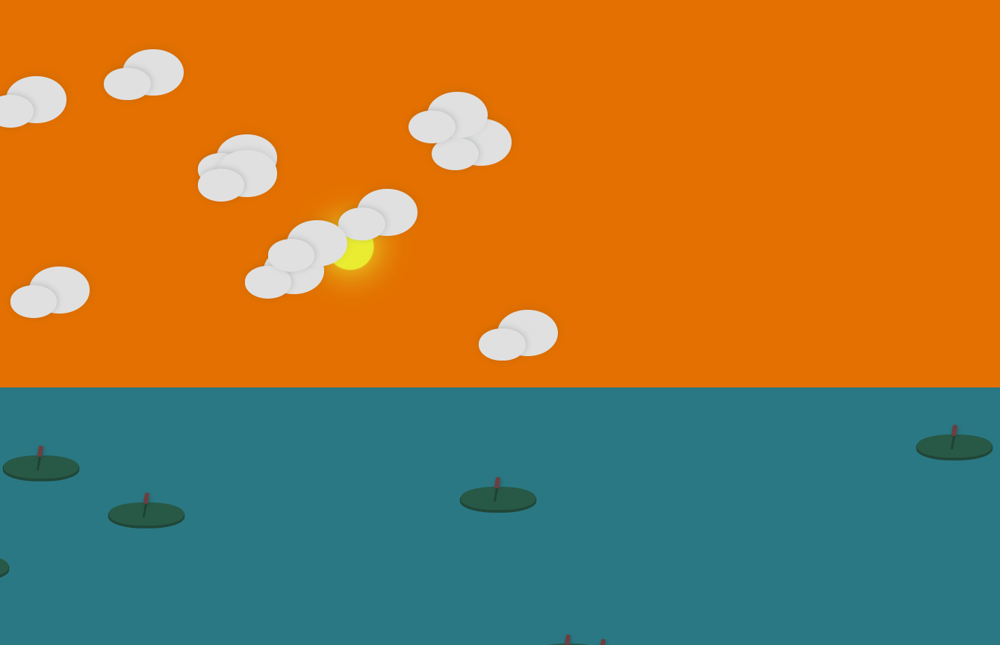
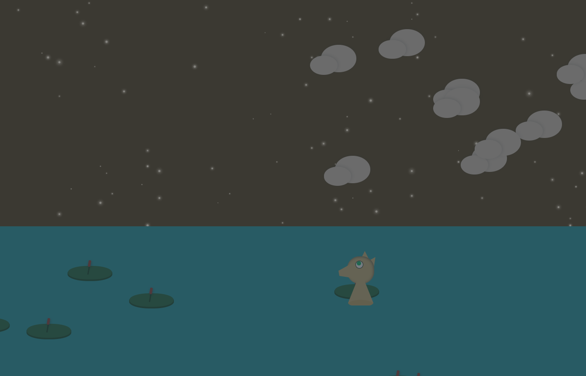
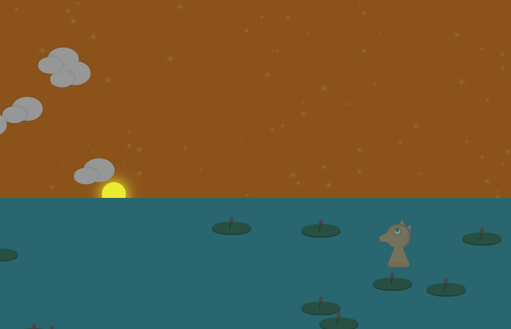

# Steady Lake

##   

### This is a small project for showing the powers of CSS.

## Description

The whole project is built only with css and jquery was used just for element placement in a random way.

 ### You can se de demo [here](https://codepen.io/2rhop/pen/yRYyzJ)

## Licence
Copyright (c) 2019 Rene Ricardo. Licensed under the [MIT](https://github.com/2rhop/steadylake/blob/master/LICENSE) license.

## Do you want to collaborate?

Send me an [email](mailto:renerp2016@gmail.com) if you have some doubt or just add an [issue](https://github.com/2rhop/steadylake/issues)